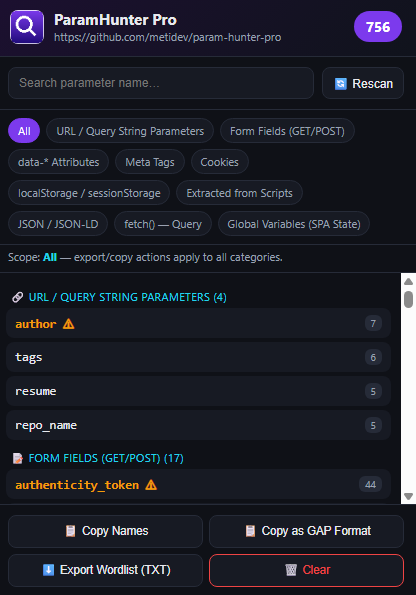

# ParamHunter Pro

**A professional Chrome extension for discovering every parameter exposed by a website — a modern, more powerful alternative to the classic GAP (Burp Suite) extension.**


ParamHunter Pro scans the current page **and** hooks into its live JavaScript runtime to surface parameter names from URLs, forms, inline/external scripts, `fetch()`/`XMLHttpRequest` calls, SPA routing, cookies, storage, and framework global state — then lets you copy or export them in a format ready for Burp Intruder, ffuf, or Arjun.

<p align="center">
  
</p>

---

## Table of Contents

- [Why ParamHunter Pro?](#why-paramhunter-pro)
- [Features](#features)
- [Installation](#installation)
- [Usage](#usage)
- [How It Works](#how-it-works)
- [Project Structure](#project-structure)
- [Permissions](#permissions)
- [Roadmap](#roadmap)
- [Contributing](#contributing)
- [Responsible Use](#responsible-use)
- [License](#license)

---

## Why ParamHunter Pro?

The classic **GAP** Burp extension parses static HTML/JS with regular expressions — links, forms, and inline scripts. ParamHunter Pro does all of that, plus everything a modern, JavaScript-heavy web app hides from static analysis.

| Capability | GAP | ParamHunter Pro |
|---|:---:|:---:|
| URL / form / static inline-script parameters | ✅ | ✅ |
| Live hook of `fetch()` and `XMLHttpRequest` (real AJAX params, incl. JSON bodies) | ❌ | ✅ |
| SPA route tracking via `pushState` / `replaceState` (React, Vue, Angular) | ❌ | ✅ |
| Discovery of global state objects (`__INITIAL_STATE__`, `__NEXT_DATA__`, `window.CONFIG`, …) | ❌ | ✅ |
| Cookie / `localStorage` / `sessionStorage` scanning | ❌ | ✅ |
| Meta tags, `data-*` attributes, HTML comments, `JSON-LD` blocks | ❌ | ✅ |
| Same-origin external `.js` file parsing | Partial | ✅ |
| Auto-highlighting of sensitive parameters (`token`, `secret`, `apikey`, `jwt`, `csrf`, …) | ❌ | ✅ |
| One-click **GAP-style copy** (`param1=XNLV0&param2=XNLV1&...`) | ✅ | ✅ |
| Scoped copy/export — limit output to one category or grab everything | ❌ | ✅ |
| Live parameter-count badge on the toolbar icon | ❌ | ✅ |
| Searchable, categorized popup UI | ❌ | ✅ |

## Features

- **Static analysis** — URL query strings, `<form>` fields, links, inline `<script>` blocks, JSON-LD blocks, `<meta>` tags, `data-*` attributes, HTML comments, cookies, and Web Storage.
- **Runtime interception** — patches `window.fetch`, `XMLHttpRequest`, `history.pushState/replaceState`, and `WebSocket` inside the page's own JS context to capture parameters from real network calls as you browse.
- **Framework-aware global scan** — flags likely app-state objects (`CONFIG`, `__INITIAL_STATE__`, `__NEXT_DATA__`, etc.) that often leak internal parameter names in SPAs.
- **Sensitive parameter highlighting** — names matching common secret/auth patterns are flagged visually.
- **Category filters** — narrow the view (and exports) to a single source, e.g. only `URL`, only `fetch`, only `Cookies`.
- **One-click exports**:
  - **Copy Names** — unique parameter names, one per line.
  - **Copy as GAP Format** — `param1=XNLV0&param2=XNLV1&...`, paste straight into Burp Intruder/Repeater.
  - **Export Wordlist (TXT)** — a sorted `.txt` file for ffuf, Arjun, or Intruder payload lists.
- **Per-tab, per-navigation scoping** — data resets on each new page load so results always match what's currently loaded.
- **Live badge counter** — see the total parameter count at a glance from the toolbar icon.

## Installation

### From source (Load Unpacked)

1. Clone or download this repository.
   ```bash
   git clone https://github.com/metidev/paramhunter-pro.git
   ```
2. Open `chrome://extensions` in Chrome (or any Chromium-based browser).
3. Enable **Developer mode** (top right).
4. Click **Load unpacked** and select the `paramhunter-pro` folder.
5. Pin the extension icon to your toolbar for quick access.

### From the Chrome Web Store

Not yet published. Contributions toward packaging and store submission are welcome.

## Usage

1. Browse the target site normally: visit pages, submit forms, click links, and interact with any AJAX-driven features. The more you interact, the more parameters get discovered — especially `fetch`/`XHR` calls and SPA routes.
2. Click the extension icon to open the popup.
3. Parameters are grouped into categories (URL, Form, `fetch`, XHR, Cookie, Storage, Global Variables, and more).
4. Use the search box to filter by name, and the category tabs to narrow the view to one source.
5. Sensitive-looking parameters are highlighted in orange with a ⚠ marker.
6. Whichever tab is currently selected — a specific category or **All** — is the scope used by every export action:
   - **Copy Names** — copies unique parameter names, one per line.
   - **Copy as GAP Format** — copies `param1=XNLV0&param2=XNLV1&...`.
   - **Export Wordlist (TXT)** — downloads a sorted wordlist file.
   - **Rescan** — re-runs the scan on the current page.
   - **Clear** — wipes collected data for the current tab.

   Select the **All** tab to include every category in the exported/copied output.

## How It Works

```
┌──────────────────────┐      injects       ┌────────────────────────┐
│   content.js          │ ─────────────────▶ │   hook.js (MAIN world)  │
│  (isolated world)      │                    │  patches fetch / XHR /  │
│  static DOM scanning   │ ◀───postMessage─── │  history / WebSocket    │
└──────────┬─────────────┘                    └────────────────────────┘
           │ chrome.runtime.sendMessage
           ▼
┌──────────────────────┐
│   background.js        │  aggregates per-tab data, updates badge
│  (service worker)       │
└──────────┬─────────────┘
           │ GET_TAB_DATA
           ▼
┌──────────────────────┐
│   popup.js / popup.html │  categorized UI, search, scoped copy/export
└──────────────────────┘
```

- `content.js` runs in every frame at `document_start`, then performs a full DOM/script/storage scan once the page is ready.
- It injects `hook.js` as a `<script>` tag so the interception code executes in the page's **real** JavaScript context (not the extension's isolated world) — this is required to see the site's own `fetch`/`XHR` calls.
- `hook.js` communicates discovered parameters back via `window.postMessage`, which `content.js` relays to the background service worker.
- `background.js` merges results per tab, updates the toolbar badge, and resets state on every new top-level navigation.
- `popup.js` renders the aggregated data, grouped by source, with search and category-scoped export actions.

## Project Structure

```
paramhunter-pro/
├── manifest.json     # MV3 manifest
├── background.js     # Service worker: per-tab aggregation, badge updates
├── content.js         # Isolated-world content script: static scanning + relay
├── hook.js             # MAIN-world script: fetch/XHR/history/WebSocket hooks
├── popup.html          # Popup UI markup
├── popup.css            # Popup UI styling
├── popup.js              # Popup UI logic (render, search, scoped copy/export)
├── icons/                # Extension icons (16/48/128)
└── README.md
```

## Permissions

| Permission | Why it's needed |
|---|---|
| `activeTab` | Interact with the currently active tab from the popup |
| `scripting` | Support for script injection APIs |
| `storage` | Reserved for future persisted settings |
| `tabs` | Query the active tab's URL/ID |
| `webNavigation` | Reset collected data on new top-level navigations |
| `host_permissions: <all_urls>` | Run the content script and hook on any site you choose to scan |

No data ever leaves your browser — everything is stored in memory per tab and discarded when the tab closes or navigates.

## Roadmap

- [ ] Cross-page crawling (same-origin, configurable depth)
- [ ] Aggregate mode: accumulate parameters across an entire browsing session per origin
- [ ] Import/replay parameter sets directly into a request-building UI
- [ ] Chrome Web Store packaging

## Contributing

Issues and pull requests are welcome. Please:

1. Fork the repository and create a feature branch.
2. Keep changes focused and include a clear description of the behavior change.
3. Test by loading the unpacked extension and verifying the popup, badge, and export actions still work as expected.

## Responsible Use

This tool is intended for **authorized security testing only** — bug bounty programs you're permitted to test, contracted penetration tests, or your own systems. Using it against systems you don't have permission to test may be illegal. The authors and contributors are not responsible for misuse.

## License

Released under the [MIT License](LICENSE).
